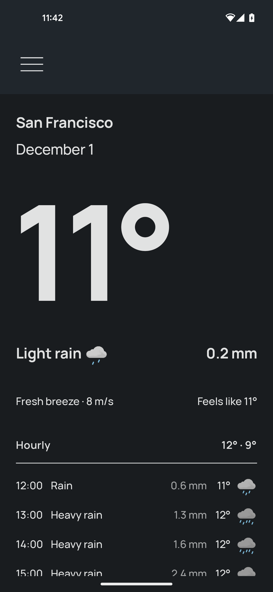
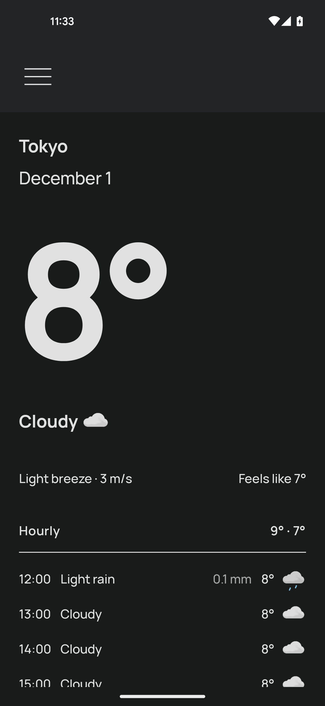
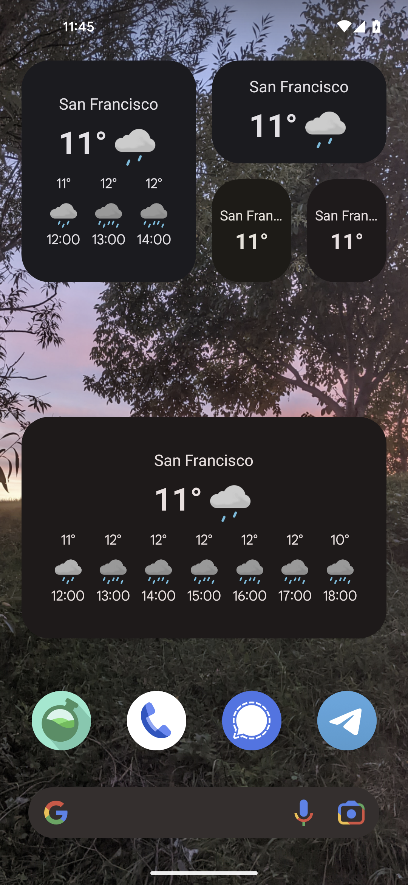
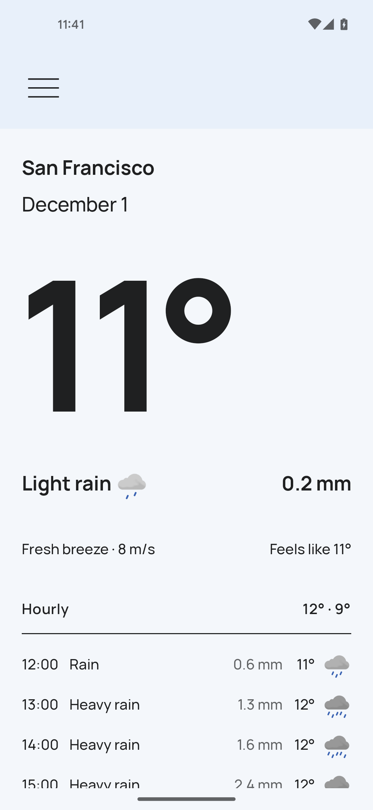
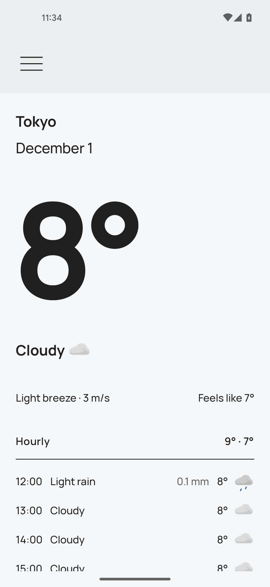
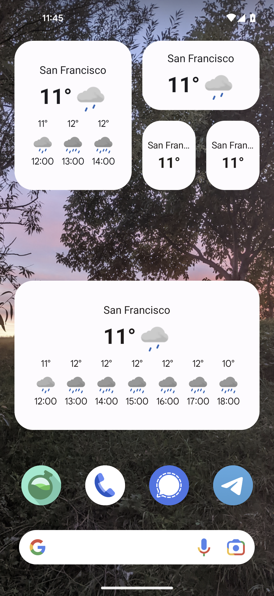

<h1 align="center" style="vertical-align:middle">Prognoza</h1>
<h3 align="center">Libre weather app with widgets and offline support</h3>

    

    
    
    

## Screenshots

    
    
    

    
    
    

## Features
- Weather for today and coming days
- App mood changes based on current conditions
- Dark and light theme
- Multiple measurement units
- Widgets
- Works offline
- Does not access your location

## Buzzwords
- Clean architecture
- Use cases
- Continuous integration
- Unit tests
- Kotlin Coroutines
- Compose (+ tests)
- Glance
- SQLDelight
- Ktor
- Kotlin Serialization
- Work Manager
- Dagger Hilt
- Compose Navigation
- Splash screen

## Credit
- Forecast data by [MET Norway](https://www.met.no/en)
- Geolocation data by [OSM Nominatim](https://nominatim.org/)
- Design by [Neal Hampton](https://dribbble.com/shots/6680361-Dribbble-Daily-UI-37-Weather-2)
- App icon by [Nataša Takač](https://www.instagram.com/art.ofil/)