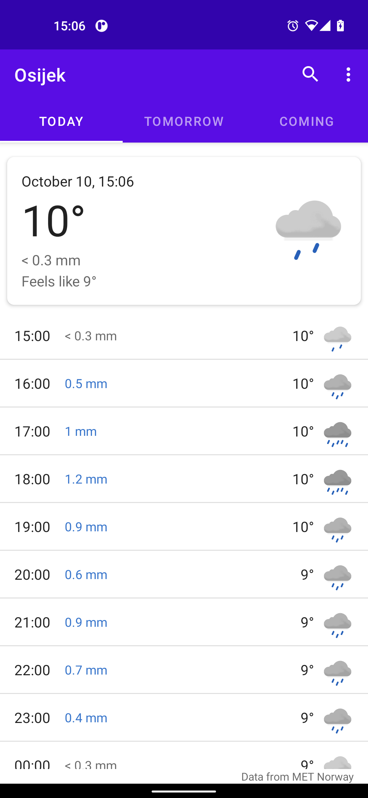
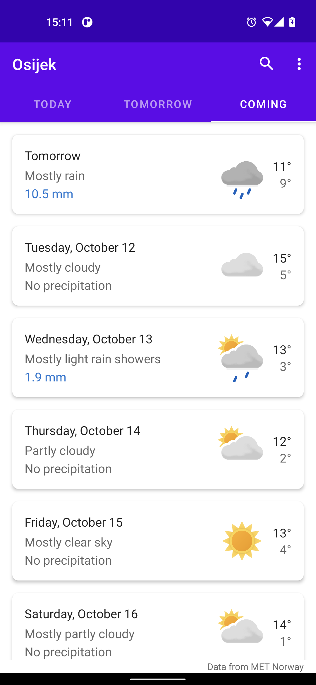
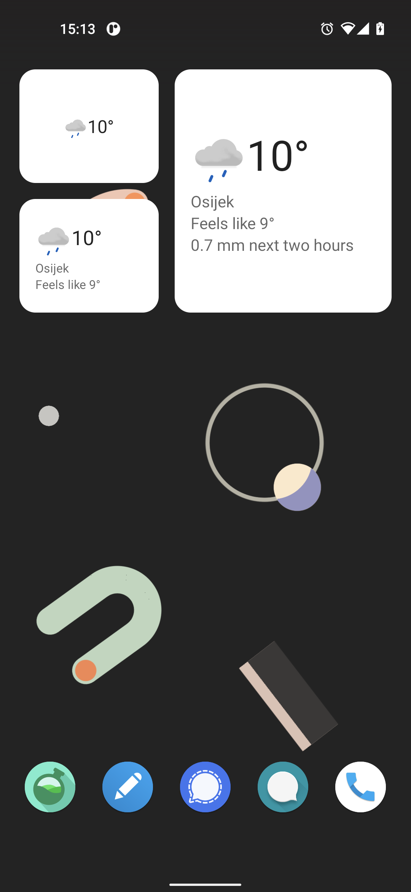
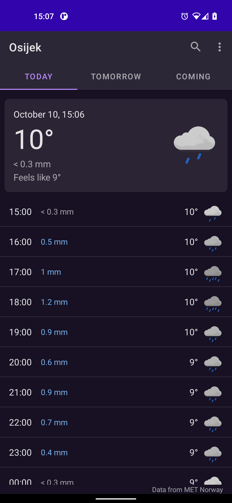
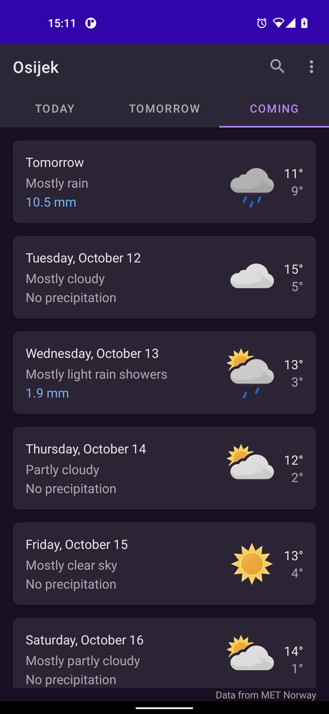
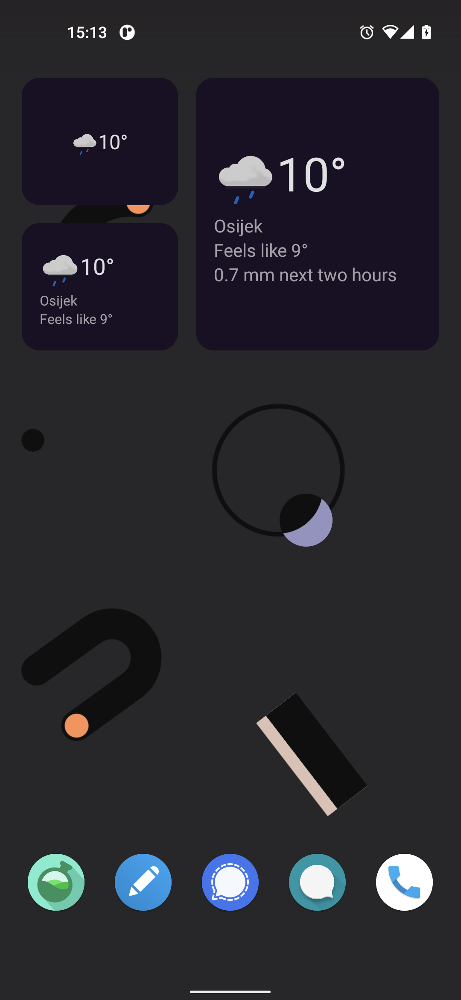

# Prognoza - weather application
 Simple and beautiful FOSS weather app that respects your privacy. Designed with the average user in mind who needs to see coming weather conditions at a glance before going out. 

## Features
### Look and feel
- Material design
- Dark theme
- Widgets

### Mobile data
- Works offline
- Low mobile data usage

### Weather data
- Metric or imperial units
- Hourly forecast for today and tomorrow
- Forecast summaries for coming days
- Temperature, weather conditions and precipitation at a glance
- Feels like, wind, air pressure and humidity in details

### Privacy
- No location permissions
- Completely free (as in freedom and beer) and open source

## Code features
- MVVM architecture
- DiffUtil
- Coroutines
- Unit testing of coroutine code
- ViewBinding
- Glide for smooth image loading
- Retrofit for network requests
- Room for forecast data caching
- Koin for dependency injection

## Credit
- [MET Norway](https://www.met.no/en) for forecast data
- [OSM Nominatim](https://nominatim.org/) for geographic location data