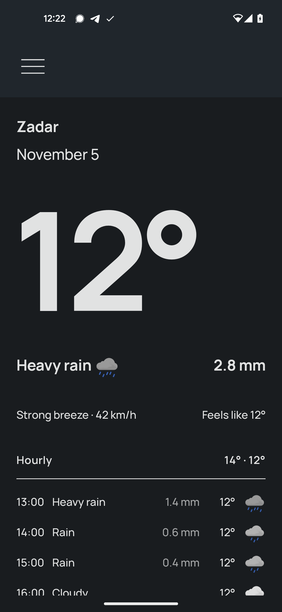
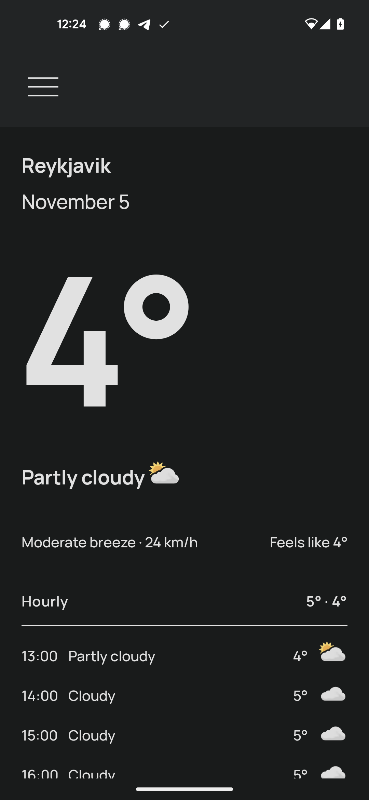
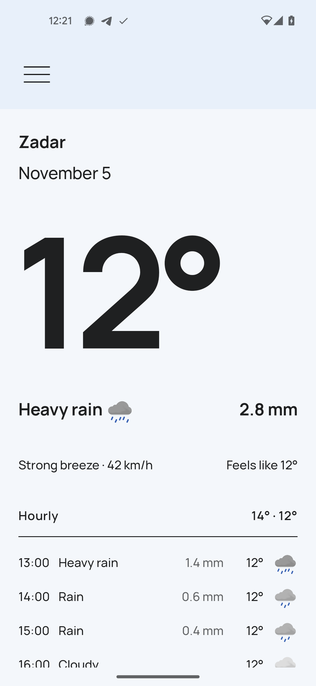
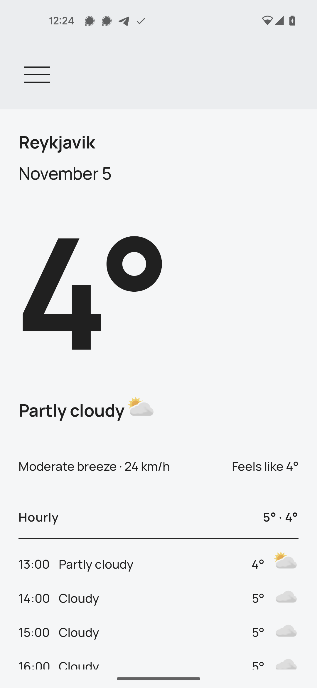

# Prognoza
Weather app with widgets and offline support.
[Latest release - on GitHub](https://github.com/davidtakac/prognoza/releases/latest)

## Features
- Weather for today and coming days
- App mood changes based on current conditions
- Dark and light theme
- Multiple measurement units
- Widgets
- Works offline
- Does not access your location

## Buzzwords
- Clean architecture
- Use cases
- Jetpack Compose
- Jetpack Glance
- SQLDelight
- Ktor
- Kotlin Serialization
- Work Manager
- Jetpack Compose tests
- Kotlin Coroutines
- Dagger Hilt
- Jetpack Compose Navigation
- Splash screen

## Credit
- Forecast data by [MET Norway](https://www.met.no/en)
- Geolocation data by [OSM Nominatim](https://nominatim.org/)
- Design by [Neal Hampton](https://dribbble.com/shots/6680361-Dribbble-Daily-UI-37-Weather-2)